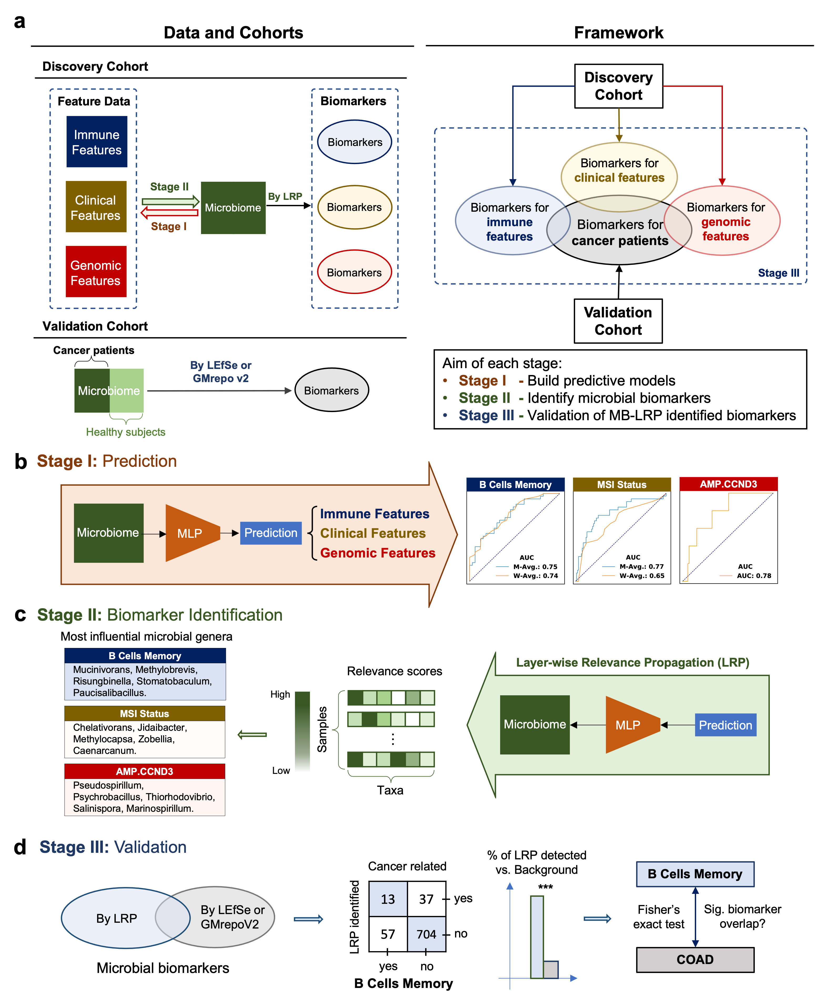

# MB-LRP

## Overview

The rapidly accumulating experimental evidence begin to support a strong association between the intratumor microbiome and tumorigenesis. However, existing studies have either focused on a limited number of bacterial species or restricted the study in a single cancer type. A comprehensive, high-throughput investigation on the role of microbial species in the clinical, immune, and genomic features of cancer patients is still lacking. To fill this gap, we developed a three-stage computational framework, named MB-LRP, which harnesses the power of explainable deep learning models to identify bacterial biomarkers associated with clinical, immune, and genomic features of cancer patients through layer-wise relevance propagation (LRP). To validate the efficacy of MB-LRP, we examined multiple MB-LRP-identified microbial biomarkers based on experimental evidence from colon cancer and stomach cancer patients and were able to confirm the presence of multiple microbial biomarkers that were previously unknown. Furthermore, we have demonstrated the clinical relevance of these biomarkers through association studies with patients’ survival outcomes. Overall, we confirmed that MB-LRP could provide a comprehensive approach for detecting microbial biomarkers and have the potential to uncover previously unexplored tumor-associated microbes. As a new, large-scale resource to the whole cancer research community, all microbial biomarkers identified by MB-LRP for a wide range of immune, clinical, and genomic features are accessible from the MB-LRP data portal (https://cdc.biohpc.swmed.edu/mblrp).

  

<b>Fig.1 Overview of the MB-LRP workflow. a.</b> Three-stage framework of MB-LRP, detailing
data source and cohort design. <b>b.</b> Workflow of Stage I: Prediction. <b>c.</b> Workflow of Stage II: Biomarker Identification. <b>d.</b> Workflow of Stage III: Validation.

## About this repository

**Folders**

"`data`" folder includes:

1. The dataset of immune, clinical and genomic traits for cancer patients of TCGA projects.

2. Normalized microbiome data processed by SHOGUN pipeline.

3. Metadata for microbiome data.

4. Biospecimen data for colon adenocarcinoma (COAD) and stomach adenocarcinoma (STAD) patients in TCGA projects.

5. Microbial biomarkers from GMrepoV2 - COAD cohort.
 
6. Microbial biomarkers by applying Linear discriminant analysis (LDA) effect size (LEfSe) method - STAD cohort.

"`immune_variables_prediction_COAD_STAD`" folder includes all Jupyter Notebooks for Stage I, II, III and survival analysis for all immune traits for COAD and STAD patients.

"`clinical_variables_prediction_COAD_STAD`" folder includes all Jupyter Notebooks for Stage I, II, III and survival analysis for all clinical traits for COAD and STAD patients.

"`mutation_CNV_prediction_COAD_STAD`" folder includes all Jupyter Notebooks for Stage I, II, III and survival analysis for all genomic traits for COAD and STAD patients.

**Codes**

In each of "`immune_variables_prediction_COAD_STAD`", "`clinical_variables_prediction_COAD_STAD`" and "`mutation_CNV_prediction_COAD_STAD`" folder, the code files are as follows:

`Stage 1 - Prediction.ipynb`: the Jupyter Notebook for Stage I: Prediction;

`Stage 2 - Model Explanation by LRP.ipynb`: the Jupyter Notebook for Stage II: Biomarker Identification;

`Stage 3 - Enrichment Analysis.ipynb`: the Jupyter Notebook for Stage III: Validation;

`Dual significance - LRP and survival.ipynb`: the Jupyter Notebook for survival analysis;

`utils_eval.py`: utility functions.

## Contacts

**Sen Yang:**

Sen.Yang@utsouthwestern.edu | senyang@smu.edu

Quantitative Biomedical Research Center, Peter O’Donnell Jr. School of Public Health, University of Texas Southwestern Medical Center, Dallas, TX, USA

Department of Statistics and Data Science, Southern Methodist University, Dallas, TX, USA

---

**Lin Xu:**

Lin.Xu@UTSouthwestern.edu

Quantitative Biomedical Research Center, Peter O’Donnell Jr. School of Public Health, University of Texas Southwestern Medical Center, Dallas, TX, USA

Department of Pediatrics, Division of Hematology/Oncology, University of Texas Southwestern Medical Center, Dallas, TX, USA 

---

**Xiaowei Zhan:**

Xiaowei.Zhan@utsouthwestern.edu

Quantitative Biomedical Research Center, Peter O’Donnell Jr. School of Public Health, University of Texas Southwestern Medical Center, Dallas, TX, USA

Center for the Genetics of Host Defense, University of Texas Southwestern Medical Center, Dallas, TX, USA

