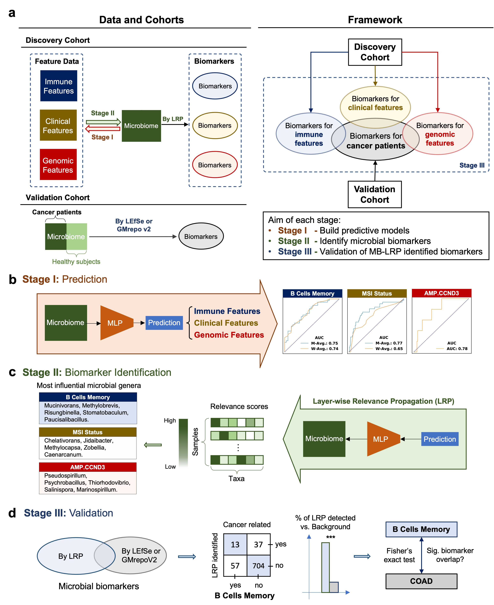

# MB-LRP

All results are accessible at the MB-LRP data portal: https://cdc.biohpc.swmed.edu/mblrp.

## Overview

Emerging evidence supports an important role for the intratumor microbiome in tumorigenesis. However, most studies have focused on a limited set of bacterial species or a single cancer type, leaving the broader relationships between diverse microbes and cancer-related features insufficiently characterized. To address this gap, we developed MB-LRP, a three-stage computational framework that combines deep learning with layer-wise relevance propagation (LRP) to identify microbial biomarkers associated with clinical, immune, and genomic features of cancer patients. Using colon and stomach cancer cohorts, we evaluated MB-LRP predictions and assessed the resulting biomarkers against available experimental evidence, confirming multiple previously unrecognized candidate biomarkers. We further improved interpretability by annotating identified taxa according to bacterial isolation source information to distinguish likely host-associated and environmental signals. Overall, MB-LRP provides a systematic approach for discovering tumor-associated microbial biomarkers and may help reveal previously unexplored cancer-microbiome associations. All microbial biomarkers identified by MB-LRP across immune, clinical, and genomic features are available through the MB-LRP data portal (https://cdc.biohpc.swmed.edu/mblrp).

<p align="center">
  
</p>

## About This Repository

This repository contains the revised MB-LRP analysis notebooks for the post-review version of the study. The workflow is organized into three analysis modules:

- `clinical_variables/`: clinical feature prediction, LRP explanation, and enrichment analysis.
- `immune_variables/`: immune feature prediction, LRP explanation, and enrichment analysis.
- `mutation_CNV/`: mutation/CNV feature prediction, LRP explanation, and enrichment analysis.

The repository also includes `Environmental_vs_host.ipynb`, which prepares BacDive isolation-source annotations used to distinguish likely host-associated and environmental microbial signals.

Each module contains:

- `Stage 1 - Prediction.ipynb`: Stage I prediction workflow.
- `Stage 2 - Model Explanation by LRP.ipynb`: Stage II biomarker identification and interpretation workflow.
- `Stage 3 - Enrichment Analysis.ipynb`: Stage III enrichment/validation workflow.
- `utils_eval.py`: shared evaluation utilities.

## Data Availability

This repository provides the MB-LRP analysis workflow. Please refer to the paper for data availability details.

## Citation

Citation information will be shared once the paper is published.

## Environment

Create the analysis environment from the included conda environment file:

```bash
conda env create -f environment.yml
conda activate mb_lrp_app_env
```

## Contacts

**Sen Yang**

sky5218@psu.edu | syang4@pennstatehealth.psu.edu

Department of Public Health Sciences, College of Medicine, Pennsylvania State University, Hershey, PA, USA

**Xiaowei Zhan**

Xiaowei.Zhan@utsouthwestern.edu

Quantitative Biomedical Research Center, Peter O'Donnell Jr. School of Public Health, University of Texas Southwestern Medical Center, Dallas, TX, USA

Center for the Genetics of Host Defense, University of Texas Southwestern Medical Center, Dallas, TX, USA
